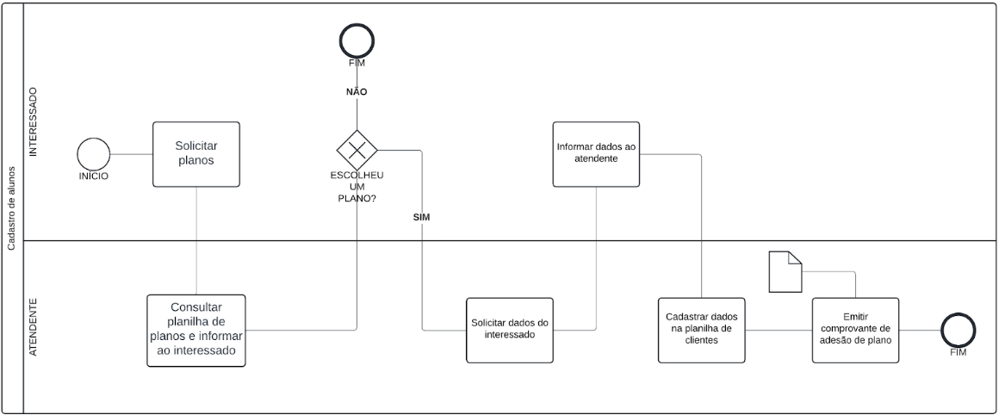
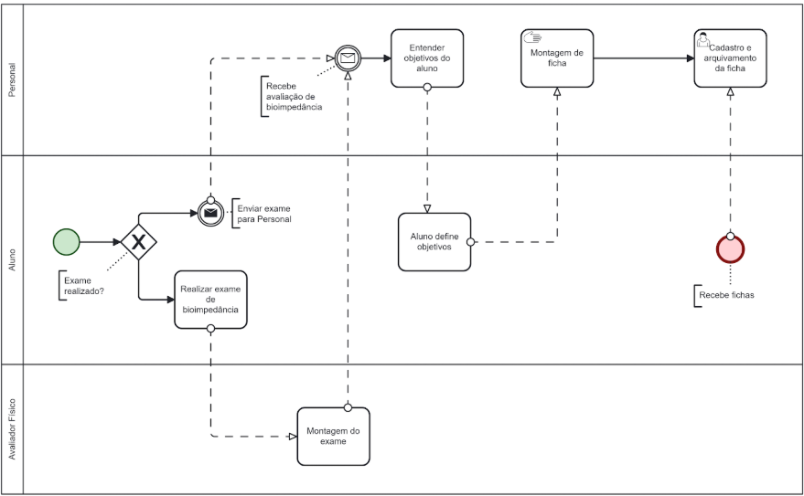

## 3. Modelagem dos Processos de Negócio

### 3.1. Modelagem da situação atual (Modelagem AS IS)

#### Cadastro de alunos: 

Atualmente, o processo de prospecção de clientes e cadastro de alunos em uma academia de ginástica é executado da seguinte maneira:
1. Primeiro Contato: O aluno vai até a academia e procura a recepção.
2. Consulta de Planos: O aluno expressa interesse em se matricular. O atendente, então, acessa uma planilha no Excel para verificar os planos disponíveis e os apresenta ao aluno.
3. Adequação do Plano: Caso o aluno encontre um plano que atenda suas necessidades, ele fornece seus dados pessoais ao atendente.
4. Cadastro do Aluno: O atendente utiliza outra planilha no Excel para cadastrar o aluno, inserindo seus dados e o plano escolhido.
5. Alternativas de Planos: Se nenhum plano disponível atender totalmente às expectativas do aluno, o atendente analisa e tenta encontrar uma opção próxima. Se houver adequação, o processo de cadastro é finalizado.
6. Encerramento: Caso nenhum plano seja adequado, o atendente encerra o processo sem a efetivação da matrícula.

#### Processo cadastro ficha do aluno:

Atualmente, o processo de cadastrar fichas de alunos em uma academia de ginástica é executado da seguinte maneira:
1. Início: Após a adequação dos planos e cadastro do aluno, deve iniciar avaliação física.
2. Avaliação Física: O aluno realiza a avaliação física para determinar seu estado de saúde e condicionamento.
3. Entendimento dos objetivos: Após a avaliação física, é realizada a triagem para entender os objetivos do aluno (perda de peso, ganho de massa, etc.).
4. Início da montagem das fichas: Com os objetivos definidos, inicia-se a montagem das fichas de treino do aluno, em paralelo ao exame de bioimpedância.
5. Cadastrar ficha: O personal trainer arquiva a ficha de treinos do aluno, incluindo os resultados do exame de bioimpedância.
6. Encerramento: O aluno agora tem acesso à sua ficha de treinos e o processo é finalizado.

#### Processo cadastro de profissional:

Atualmente, o processo de cadastrar um profissional em uma academia de ginástica é executado da seguinte forma:
1. Início: Uma vaga é aberta - para funcionários administrativos, instrutores físicos ou profissionais da saúde - e divulgada localmente.
2. Primeiro contato: O profissional entrega seu currículo pessoalmente ou via e-mail
3. Entrevista: Após a equipe administrativa avaliar os currículos, os profissionais são chamados para uma entrevista presencial.
4. Contratação: Finalizada a etapa de entrevistas, os profissionais selecionados são contratados.
5. Cadastro do Profissional: Em uma planilha de funcionários, os dados do profissional são cadastrados - incluindo a unidade em que trabalhará, tipo de contratação (CLT ou PJ)...
6. Encerramento: O profissional passará a cumprir sua jornada de trabalho na academia de ginástica.

#### Processo - Bioimpedância

Atualmente, o processo de cadastrar um profissional em uma academia de ginástica é executado da seguinte forma:
1. O cliente manifesta o interesse à recepcionista da academia que deseja realizar o exame de bioimpedância.
2. A recepcionista informa os dias e horários disponíveis para realizar o exame, de acordo com seu caderno de agendamentos.
3. O cliente escolhe o dia e horário mais conveniente para ele.A recepcionista fornece informações sobre o exame e orienta em relação às recomendações.
4. No dia do exame o cliente preenche um formulário (manuscrito) com dados como:
    * idade,
    * altura,
    * e propósito com a atividade física (emagrecimento, ganho de massa, qualidade de vida).
  
    O profissional de educação física realiza o exame (equipamento de bioimpedância).
6. O profissional de educação física escreve um relatório com o resultado e fornece um feedback ao cliente.

### 3.2. Descrição geral da proposta (Modelagem TO BE)

#### Limites da Solução Proposta:
A integração de dados pode ser complexa, uma vez que o sistema terá que gerenciar o cadastro de funcionários, alunos, planos, fichas de treino e dados de bioimpedância. Além disso, a equipe pode demorar a se adequar ao novo sistema, principalmente se estiver acostumada a trabalhar com planilhas e processos manuais, o que pode impactar a eficiência inicial. Outro limite da solução é que o sistema, por enquanto, se restringe ao escopo interno da academia, não permitindo que os alunos façam seu cadastro de forma independente, o que seria uma funcionalidade útil para aumentar a agilidade do processo.

#### Alinhamento com as Estratégias e Objetivos do Negócio:
O novo sistema de cadastro visa aumentar a satisfação do cliente ao eliminar falhas de comunicação durante a etapa de apresentação dos planos e garantir uma integração eficiente dos dados. A solução também está alinhada com os objetivos de escalabilidade da academia, assegurando a capacidade de atender um número exponencial de alunos de forma eficiente e organizada, sem comprometer a gestão dos dados.

Os principais aspectos da solução são:
1. Sistema de Gerenciamento Integrado:
  Todos os dados dos planos, alunos e matrículas serão geridos de forma centralizada, substituindo as múltiplas planilhas do Excel, garantindo a integridade dos dados.
2. Consulta de Planos Automatizada:
  O atendente poderá acessar a aba de planos diretamente no sistema, que exibirá de forma clara e objetiva todas as opções disponíveis, personalizadas de acordo com o perfil do aluno.
3. Cadastro Automatizado:
  O sistema permitirá o cadastro automático do aluno, registrando suas informações e planos de forma precisa e integrada, eliminando a necessidade de múltiplos registros em diferentes planilhas.
4. Geração de Login e Acompanhamento:
  Ao final do processo, o sistema gerará um login para o aluno, permitindo que ele acompanhe suas aulas e outras informações importantes de forma independente e online.

### 3.3. Modelagem dos processos

[PROCESSO 1 - Cadastro do Aluno](./processos/Processo1-CadastroAluno.md)

[PROCESSO 2 - Cadastro da Ficha do Aluno](./processos/Processo2-CadastroFichaAluno.md)

[PROCESSO 3 - Cadastro da Bioimpedância](./processos/Processo3-Bioimpedancia.md)

[PROCESSO 4 - Cadastro do Profissional](./processos/Processo4-CadastroProfissional.md)
